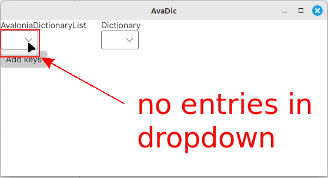
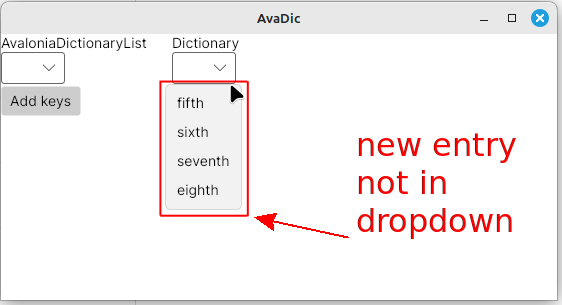

# Bugs with AvaloniaDictionary + BindingOperations.GetBindingExpressionBase().UpdateSource()


## Pre-requisites
* .NET SDK 9


## Platform
* Linux Mint 21.2
* Avalonia --> 11.2.4
* Avalonia.Desktop --> 11.2.4
* Avalonia.Themes.Fluent --> 11.2.4
* Avalonia.Fonts.Inter --> 11.2.4
* Avalonia.Diagnostics --> 11.2.4">
* CommunityToolkit.Mvvm --> 8.4.0


## Getting started
```bash
# clone repo
git clone https://github.com/TrevorDArcyEvans/AvaDic.git

# build
cd AvaDic
dotnet build

# run app
dotnet run
```


## [BUG] AvaloniaDictionary does not show ItemTemplate
* start app
* drop down combo box under heading `AvaloniaDictionaryList`
* [OBSERVED]<br>

* no entries in dropdown
* [EXPECTED] several entries in dropdown


# [BUG] BindingOperations.GetBindingExpressionBase().UpdateSource() does not update ItemsSource 
* start app
* click button `Add keys`
* drop down combo box under heading `AvaloniaDictionaryList`
* [OBSERVED]<br>
  
* still no entries in dropdown
* [EXPECTED] new entry in dropdown
* drop down combo box under heading `Dictionary`
* [OBSERVED]<br>
  
* new entry not in dropdown
* [EXPECTED] new entry in dropdown


# [BUG] BindingOperations.GetBindingExpressionBase().UpdateSource() second time deletes ItemsSource
* start app
* click button `Add keys` (first time)
* [OBSERVED] nothing
* click button `Add keys` (second time)
* [OBSERVED] CRASH
  <details>

    ```csharp
    System.NullReferenceException: Object reference not set to an instance of an object.
       at AvaDic.ViewModels.MainWindowViewModel.AddKey() in /home/trevorde/dev/AvaDic/ViewModels/MainWindowViewModel.cs:line 35
       at CompiledAvaloniaXaml.XamlIlTrampolines.AvaDic:AvaDic.ViewModels.MainWindowViewModel+AddKey_0!CommandExecuteTrampoline(Object, Object)
       at Avalonia.Data.Core.ExpressionNodes.MethodCommandNode.Command.Execute(Object parameter)
       at Avalonia.Controls.Button.OnClick()
       at Avalonia.Controls.Button.OnPointerReleased(PointerReleasedEventArgs e)
       at Avalonia.Input.InputElement.<>c.<.cctor>b__32_9(InputElement x, PointerReleasedEventArgs e)
       at Avalonia.Interactivity.RoutedEvent`1.<>c__DisplayClass1_0`1.<AddClassHandler>g__Adapter|0(Object sender, RoutedEventArgs e)
       at Avalonia.Interactivity.RoutedEvent.<>c__DisplayClass23_0.<AddClassHandler>b__0(ValueTuple`2 args)
       at Avalonia.Reactive.AnonymousObserver`1.OnNext(T value)
       at Avalonia.Reactive.LightweightObservableBase`1.PublishNext(T value)
       at Avalonia.Reactive.LightweightSubject`1.OnNext(T value)
       at Avalonia.Interactivity.RoutedEvent.InvokeRaised(Object sender, RoutedEventArgs e)
       at Avalonia.Interactivity.EventRoute.RaiseEventImpl(RoutedEventArgs e)
       at Avalonia.Interactivity.EventRoute.RaiseEvent(Interactive source, RoutedEventArgs e)
       at Avalonia.Interactivity.Interactive.RaiseEvent(RoutedEventArgs e)
       at Avalonia.Input.MouseDevice.MouseUp(IMouseDevice device, UInt64 timestamp, IInputRoot root, Point p, PointerPointProperties props, KeyModifiers inputModifiers, IInputElement hitTest)
       at Avalonia.Input.MouseDevice.ProcessRawEvent(RawPointerEventArgs e)
       at Avalonia.Input.MouseDevice.ProcessRawEvent(RawInputEventArgs e)
       at Avalonia.Input.InputManager.ProcessInput(RawInputEventArgs e)
       at Avalonia.Controls.TopLevel.<>c.<HandleInput>b__145_0(Object state)
       at Avalonia.Threading.Dispatcher.Send(SendOrPostCallback action, Object arg, Nullable`1 priority)
       at Avalonia.Controls.TopLevel.HandleInput(RawInputEventArgs e)
       at Avalonia.X11.X11Window.DispatchInput(RawInputEventArgs args)
       at Avalonia.RawEventGrouper.Dispatch(RawInputEventArgs ev)
       at Avalonia.ManualRawEventGrouperDispatchQueue.DispatchNext()
       at Avalonia.X11.X11PlatformThreading.RunLoop(CancellationToken cancellationToken)
       at Avalonia.Threading.DispatcherFrame.Run(IControlledDispatcherImpl impl)
       at Avalonia.Threading.Dispatcher.PushFrame(DispatcherFrame frame)
       at Avalonia.Threading.Dispatcher.MainLoop(CancellationToken cancellationToken)
       at Avalonia.Controls.ApplicationLifetimes.ClassicDesktopStyleApplicationLifetime.StartCore(String[] args)
       at Avalonia.Controls.ApplicationLifetimes.ClassicDesktopStyleApplicationLifetime.Start(String[] args)
       at Avalonia.ClassicDesktopStyleApplicationLifetimeExtensions.StartWithClassicDesktopLifetime(AppBuilder builder, String[] args, Action`1 lifetimeBuilder)
       at AvaDic.Program.Main(String[] args) in /home/trevorde/dev/AvaDic/Program.cs:line 12
    ```

  </details>

* [EXPECTED] no crash
* [EXPECTED] ItemsSource aka DataMap not to be null


## [Avalonia](https://github.com/AvaloniaUI/Avalonia) repository
* [AvaloniaDictionary does not show ItemTemplate](https://github.com/AvaloniaUI/Avalonia/issues/18296)
* [BindingOperations.GetBindingExpressionBase().UpdateSource() does not update ItemsSource](https://github.com/AvaloniaUI/Avalonia/issues/18297)
* [BindingOperations.GetBindingExpressionBase().UpdateSource() second time deletes ItemsSource](https://github.com/AvaloniaUI/Avalonia/issues/18298)

## Acknowledgements
* [AvaloniaDictionary](https://reference.avaloniaui.net/api/Avalonia.Collections/AvaloniaDictionary_2/)

